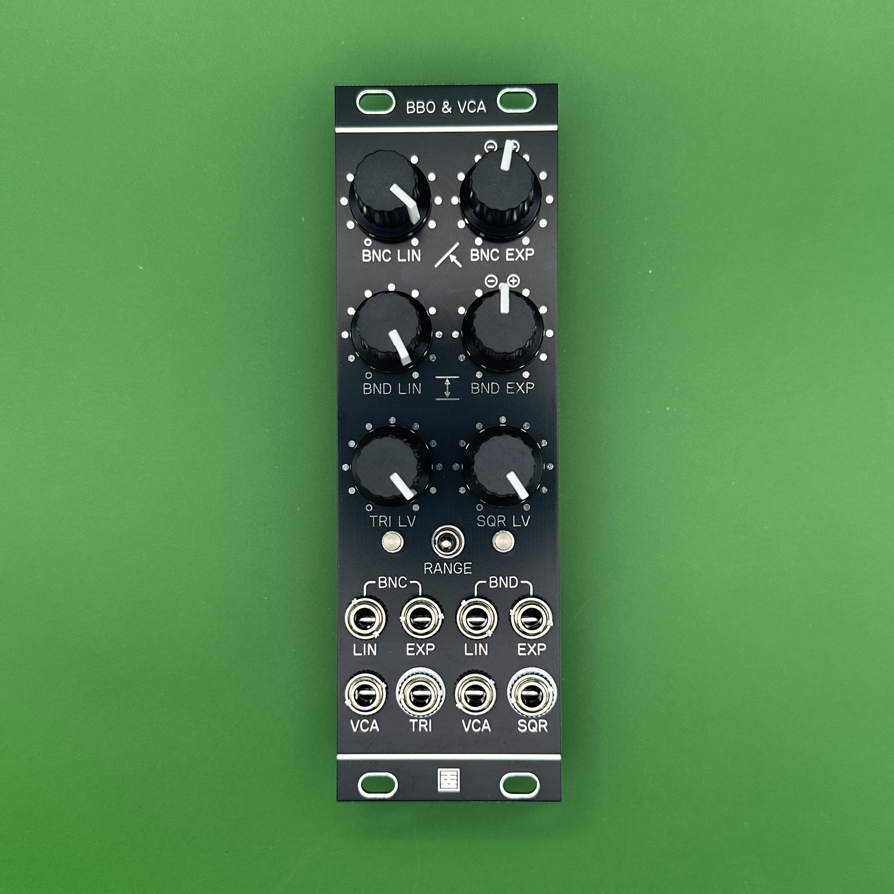
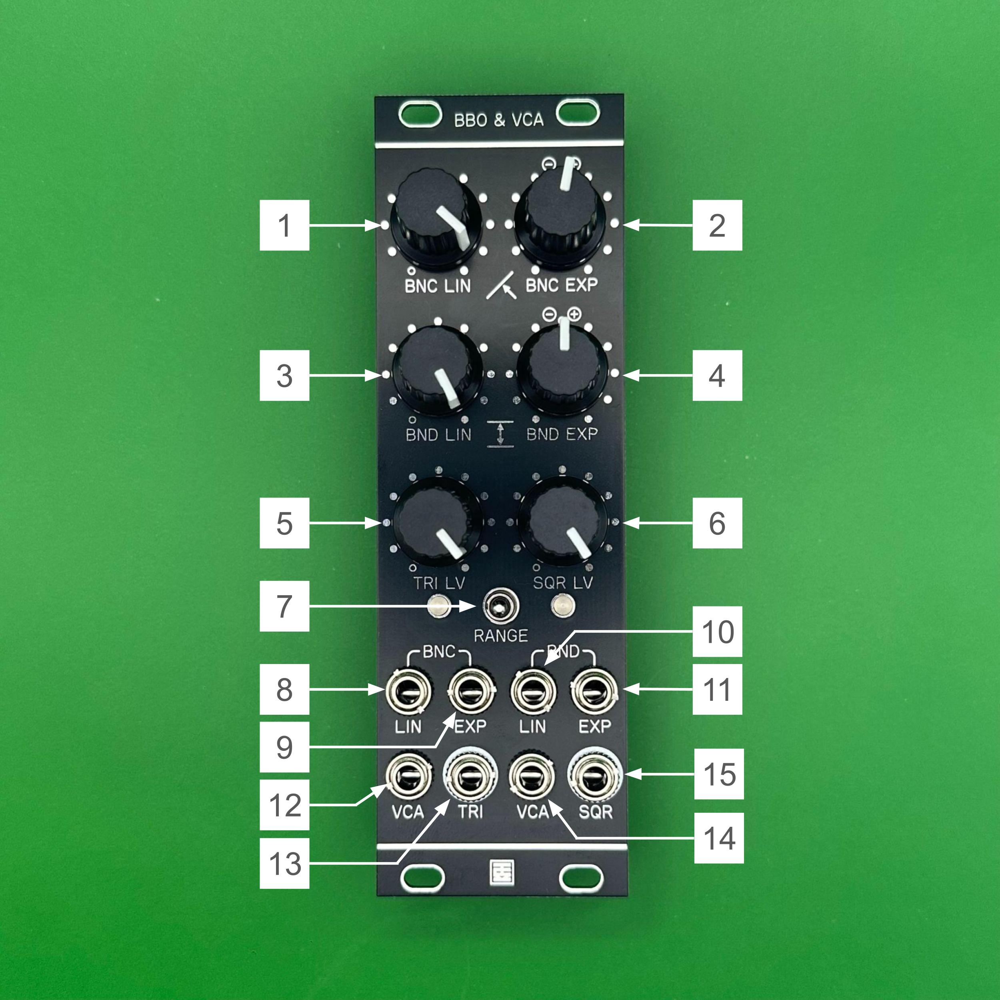

# BBO&VCA Manual (EN)

## Overview

**BBO&VCA** is a "Bounds Bounce Oscillator" inspired by Ieaskul F. Mobenthey’s *Denum* and the [crucFX Utility BBO](https://github.com/d42kn355/BoundsBounceOscillator).  
This oscillator is based on two key concepts: **Bounce** and **Bounds**.  
Imagine a ball bouncing back and forth between two walls. The **Bounce** represents the speed of the ball, and the **Bounds** represent the distance between the walls.  
In this oscillator, increasing the Bounce raises the frequency, while narrowing the Bounds increases the frequency further but reduces the amplitude. In other words, bringing the walls closer causes the ball (signal) to move faster.

**BBO&VCA** allows you to independently adjust and modulate both Bounce and Bounds. The main output always provides a triangle wave, while a secondary output provides a square wave.  
A range switch offers three operating modes:
- Standard audio rate  
- Low audio rate  
- LFO rate

Both the triangle and square waves are passed through dedicated linear VCAs, allowing their amplitude (volume) to be controlled via knobs or external CV.

## Specifications

- **Format**: Eurorack  
- **Width**: 8 HP  
- **Depth**: 25 mm  
- **Current Consumption**: +12V: 60mA / -12V: 60mA  

> **IMPORTANT**: Connect the ribbon cable so that the red stripe aligns with -12V.  
> Incorrect connection may damage the module.  
> **Always check cable orientation before powering on.**

## Functions of Each Section

1. **BNC LIN**  
   Sets the base position and speed (rate) for Bounce.

2. **BNC EXP**  
   Attenuverter for the CV signal connected to BNC EXP IN. At the center position, modulation is off. Turning clockwise applies modulation with positive polarity, and counterclockwise applies it with inverted polarity.

3. **BND LIN**  
   Sets the base position and speed (rate) for Bounds.

4. **BND EXP**  
   Attenuverter for the CV signal connected to BND EXP IN. At the center position, modulation is off. Turning clockwise applies modulation with positive polarity, and counterclockwise applies it with inverted polarity.

5. **TRI LV**  
   Adjusts the amplitude (volume) of the triangle wave.

6. **SQR LV**  
   Adjusts the amplitude (volume) of the square wave.

7. **RANGE**  
   Switch to select oscillator range. Three options available:  
   - Standard audio rate  
   - Low audio rate  
   - LFO rate

8. **BNC LIN IN**  
   Linear CV input for Bounce.

9. **BNC EXP IN**  
   Exponential CV input for Bounce.

10. **BND LIN IN**  
   Linear CV input for Bounds.

11. **BND EXP IN**  
   Exponential CV input for Bounds.

12. **TRI VCA IN**  
   CV input for triangle wave amplitude control.

13. **TRI OUT**  
   Triangle wave output.

14. **SQR VCA IN**  
   CV input for square wave amplitude control.

15. **SQR OUT**  
   Square wave output.

> *This module does not support standard 1V/oct pitch tracking.*

## License

This work is licensed under the [Creative Commons Attribution-ShareAlike 4.0 International (CC BY-SA 4.0)](https://creativecommons.org/licenses/by-sa/4.0/deed.en).

## Credits

- **Designed by**: StudioKAT  
- **Website**: [https://www.studiokat.jp/](https://www.studiokat.jp/)  
- **GitHub**: [https://github.com/StudioKAT](https://github.com/StudioKAT)  
- **X (formerly Twitter)**: [https://x.com/StudioKAT_synth](https://x.com/StudioKAT_synth)  
- **Instagram**: [https://www.instagram.com/studiokat_modular/](https://www.instagram.com/studiokat_modular/)

## Revision History

- `2025-06-24`: v1.0 Release
